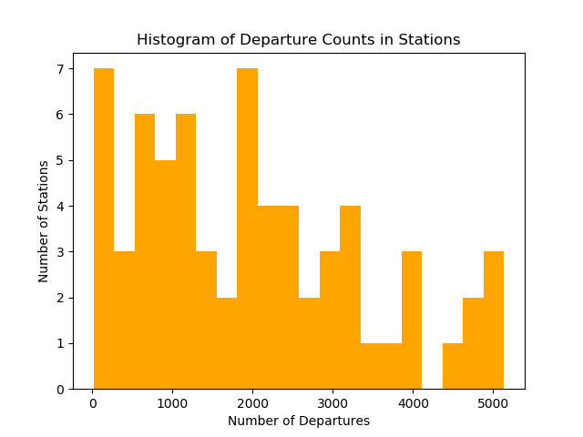
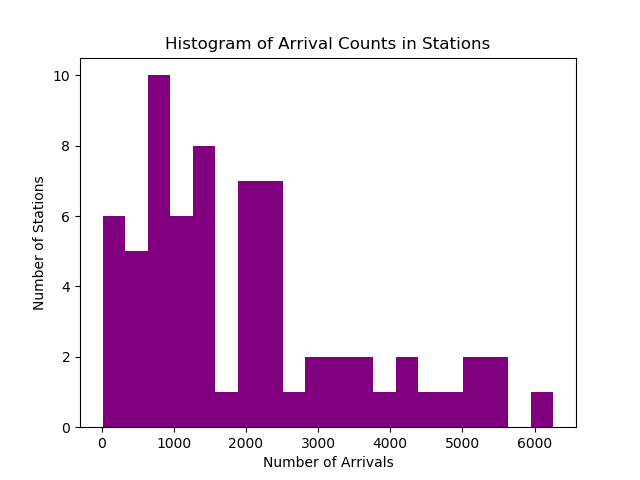

The code used to make these findings can be found [here](https://github.com/alex-kj-chin/capital_one_challenge).

# Questions (1-4)

The following subsections are organized so as to match up to Questions 1-4 on the MindSumo website and facillitate ease of checking the requirements ahve been met.

## Data Visualizations

A variety of other visualizations will be provided to answer questions throughout.

### Start/Stop Stations Popularity

I chose to cross-reference the keys in the provided data set with the [station metadata](https://bikeshare.metro.net/about/data/) so as to be able to provide the plain-text names of the most popular stations. The five most popular stations for arrival were

1. 7th & Flower (4.7%, 6262 total)
2. 7th & Spring (4.2%, 5517 total)
3. Union Station West Portal (4.1%, 5385 total)
4. 1st & Central (4%, 5293 total)
5. Broadway & 3rd (3.8%, 5072 total)

Similarly, the five most popular stations for departure were

1. Broadway & 3rd (3.9%, 5138 total)
2. Main & 1st (3.8%, 5059 total)
3. 7th & Flower (3.7%, 4883 total)
4. Grand & 7th (3.5%, 4661 total)
5. 7th & Spring (3.5%, 4629 total)

One might notice that there is a good amount of overlap between the most common points of departure and arrival. In fact, 9 of the top 10 arrival and departure locations are shared. This makes a lot of sense, ass individuals who depart from one location and arrive at another are likely to later depart from their initial arrival station and arrive at their initial departure station (round trips will be a slight confounding factor here, but clearly not too large). I also chose to do a general aggregation of the data. Below I present histograms of the number of arrivals and departures





#### Header 4

*   This is an unordered list following a header.
*   This is an unordered list following a header.
*   This is an unordered list following a header.

##### Header 5

1.  This is an ordered list following a header.
2.  This is an ordered list following a header.
3.  This is an ordered list following a header.

###### Header 6

| head1        | head two          | three |
|:-------------|:------------------|:------|
| ok           | good swedish fish | nice  |
| out of stock | good and plenty   | nice  |
| ok           | good `oreos`      | hmm   |
| ok           | good `zoute` drop | yumm  |

### There's a horizontal rule below this.

* * *

### Here is an unordered list:

*   Item foo
*   Item bar
*   Item baz
*   Item zip

### And an ordered list:

1.  Item one
1.  Item two
1.  Item three
1.  Item four

### And a nested list:

- level 1 item
  - level 2 item
  - level 2 item
    - level 3 item
    - level 3 item
- level 1 item
  - level 2 item
  - level 2 item
  - level 2 item
- level 1 item
  - level 2 item
  - level 2 item
- level 1 item

### Small image


### Large image


### Definition lists can be used with HTML syntax.

<dl>
<dt>Name</dt>
<dd>Godzilla</dd>
<dt>Born</dt>
<dd>1952</dd>
<dt>Birthplace</dt>
<dd>Japan</dd>
<dt>Color</dt>
<dd>Green</dd>
</dl>

```
Long, single-line code blocks should not wrap. They should horizontally scroll if they are too long. This line should be long enough to demonstrate this.
```

```
The final element.
```
